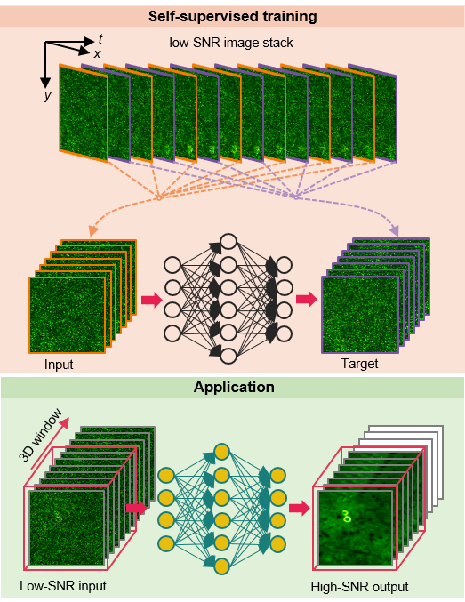

# DeepCAD: 


## Contents

- [Overview](#overview)
- [Directory structure](#directory-structure)
- [Pytorch code](#pytorch-code)
 
## Overview



Calcium imaging is inherently susceptible to detection noise especially when imaging with high frame rate or under low excitation dosage. However, calcium transients are highly dynamic, non-repetitive activities and a firing pattern cannot be captured twice. Clean images for supervised training of deep neural networks are not accessible. Here, we present DeepCAD, a **deep** self-supervised learning-based method for **ca**lcium imaging **d**enoising. Using our method, detection noise can be effectively removed and the accuracy of neuron extraction and spike inference can be highly improved.

DeepCAD is based on the insight that a deep learning network for image denoising can achieve satisfactory convergence even the target image used for training is another corrupted sampling of the same scene. We explored the temporal redundancy of calcium imaging and found that any two consecutive frames can be regarded as two independent samplings of the same underlying firing pattern. A single low-SNR stack is sufficient to be a complete training set for DeepCAD. Furthermore, to boost its performance on 3D temporal stacks, the input and output data are designed to be 3D volumes rather than 2D frames to fully incorporate the abundant information along time axis.

For more details, please see the companion paper where the method appeared: 
["*Reinforcing neuron extraction and spike inference in calcium imaging using deep self-supervised learning*".](https://www.biorxiv.org/content/10.1101/2020.11.16.383984v1)

## Directory structure

```
DeepCAD-Pro
|---train.py
|---test.py
|---script.py
|---network.py
|---model_3DUnet.py
|---data_process.py
|---buildingblocks.py
|---utils.py
|---datasets
|---|---DataForPytorch #project_name#
|---|---|---data.tif
|---pth
|---|---ModelForPytorch
|---|---|---model.pth
|---results
|---|--- # Intermediate and final results#
```


## Pytorch code

### Environment 

* Ubuntu 16.04 
* Python 3.6
* Pytorch >= 1.3.1
* NVIDIA GPU (24 GB Memory) + CUDA

### Environment configuration

Open the terminal of ubuntu system.

* Install Pytorch

```
$ conda create -n pytorch python=3.6
$ source activate pytorch
$ pip install torch==1.3.1
$ conda install pytorch torchvision cudatoolkit -c pytorch
```

* Install other dependencies

```
$ conda install -c anaconda matplotlib opencv scikit-learn scikit-image
$ conda install -c conda-forge h5py pyyaml tensorboardx tifffile
```

### Training

Download the demo data(.tif file) [[DataForPytorch](https://drive.google.com/drive/folders/1w9v1SrEkmvZal5LH79HloHhz6VXSPfI_)] and put it into *DeepCAD_pytorch/datasets/DataForPytorch.*.

Run the **script.py (python script.py train)* to begin your train.

```
$ source activate pytorch
$ python script.py train
```

### Test

Run the **script.py (python script.py test)** to begin your test. Parameters saved in the .yaml file will be automatically loaded.

```
$ source activate pytorch
$ python script.py test-all
```

Parameters can be modified  as required in **script.py**.

```
$ os.system('python test.py --denoise_model #A folder containing models to be tested# --datasets_folder #A folder containing files to be tested# --test_datasize #dataset size to be tested#')
```
